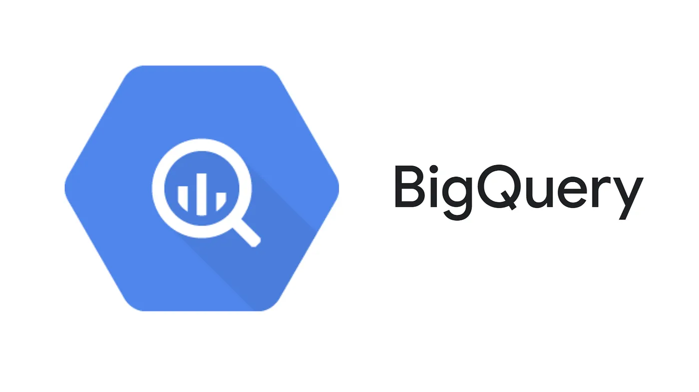

# Google BigQuery

## A Step-by-step Guide to BigQuery

BigQuery is a cloud-based data warehousing and business intelligence service provided by Google Cloud Platform. It enables users to analyze and process large datasets using SQL-like syntax and provides a highly scalable, fast, and cost-effective solution for storing and querying massive amounts of data. With BigQuery, users can perform advanced analytics on data in real-time, build machine learning models, and run complex queries on petabyte-scale data. BigQuery integrates with various data sources and offers powerful features like data visualization, data sharing, and machine learning. It is widely used by businesses, data analysts, and data scientists for processing and analyzing large datasets.

But Going into more details on BigQuery, first let's know what are main query languages used, what is a database, and understand the differences between a few terminologies.

## Query Languages (QL)

- QL is a general term used to describe a variety of query languages used in database management systems (DBMS).
- These query languages are used to interact with the database, allowing users to search, retrieve, and modify data stored within the system.

## Important Query languages:

There are numerous Query Languages (QL) used in database management systems (DBMS). Some of the most common QLs include:

1. SQL (Structured Query Language)- used to communicate with relational databases.
2. XQuery- used to retrieve and manipulate data stored in XML documents.
3. SPARQL (SPARQL Protocol and RDF Query Language) - used to query and manipulate data stored in RDF databases.
4. Cypher - used to query graph databases.
5. Gremlin- used to traverse and manipulate graph data stored in graph databases.
6. MDX (Multidimensional Expressions) - used to query data stored in multidimensional databases.
7. Datalog- used to query and reason about data stored in deductive databases.
8. FQL (Facebook Query Language) - used to query data stored in Facebook's data infrastructure.
9. SOQL (Salesforce Object Query Language) - used to query data stored in Salesforce's customer relationship management (CRM) system.
10. OQL (Object Query Language) - used to query and manipulate data stored in object-oriented databases.

These are just a few examples of the many QLs used in database management systems.

# Database

A database is a structured collection of data that is organized and stored in a computer system. It can be used to store and manage various types of data, such as 
customer information, sales data, inventory records, and much more.

Database management involves the tasks of creating, maintaining, securing, and optimizing a database to ensure that it can be used effectively and efficiently. This typically involves the use of specialized software known as a database management system (DBMS) that provides tools and features to manage the database.

## Types of DBMSs

There are different types of DBMSs, including:

- **Relational DBMS** - organizes data in tables with rows and columns, and uses SQL to manipulate the data. Examples: MySQL, Database, SQL Server, PostgreSQL, SQLite, BigQuery

- **NoSQL DBMS** - used for managing unstructured data such as social media posts, multimedia content, and documents. Examples: MongoDB, Cassandra, Redis

- **Object-oriented DBMS** - used for managing object-oriented data such as Java objects. Examples: db4o, ObjectDB

- **Cloud-based DBMS** - A cloud-based DBMS is a type of database management system that is hosted on a cloud computing platform. It provides users with access to their databases from anywhere with an internet connection and offers scalability, flexibility, and reliability. Cloud-based DBMS can be divided into two categories - 
    1. Database-as-a-service (DBaaS): This type of cloud-based DBMS offers a fully managed database service where the cloud provider takes care of all the management tasks, such as software updates, backups, and security. Examples: Amazon RDS, Google Cloud SQL, and Azure SQL Database.
    
    2. Infrastructure-as-a-service (IaaS): This type of cloud-based DBMS offers users more control over their database environment. They can choose their own operating system, software, and configuration settings. Examples: Amazon EC2, Google Compute Engine, and Microsoft Azure Virtual Machines.

## Examples of some popular cloud-based DBMS

- Bigquery - BigQuery is a specific implementation of a query language developed by Google, used to manage data stored in the cloud.- 
- Amazon Redshift - A cloud-based data warehouse provided by Amazon Web Services (AWS).
- Snowflake - A cloud-based data warehousing platform.
- Microsoft Azure Synapse Analytics - A cloud-based analytics service that provides data warehousing and big data processing.
- Apache Hive - An open-source data warehousing and SQL-like query language used with Hadoop.

Reference
- https://cloud.google.com/bigquery
- https://github.com/arunsinp/SQL-data-analytics/blob/main/Notes-on-SQL.ipynb
- https://github.com/arunsinp/SQL-data-analytics/blob/main/SQL-Notes.pdf
- https://github.com/arunsinp/SQL-data-analytics